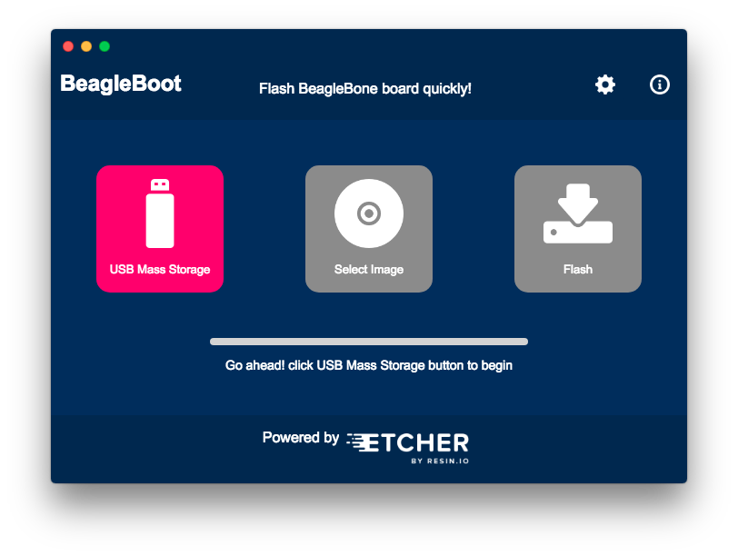

# BeagleBoot  

A cross platform flashing app for BeagleBone hardware. This app aims to provide a easy to use GUI to flash BeagleBone's onboard emmc.
___
### [Download](https://github.com/ravikp7/BeagleBoot/releases) | [Architecture](https://github.com/ravikp7/BeagleBoot/blob/master/doc/ARCHITECTURE.md) | [Development](https://github.com/ravikp7/BeagleBoot/blob/master/doc/DEVELOPMENT.md)
___

    

### Currently Supported Platrforms: Linux, OSX (10.9 +)
___
This project's development started during `Google Summer of Code 2017 under BeagleBoard Organisation`. This app is accompained by the underlying [node-beagle-boot](https://github.com/ravikp7/node-beagle-boot) `usb bootloader server` for the BeagleBone hardware platform developed during same period.

See [this video](https://www.youtube.com/watch?v=5JYfh2_0x8s) for more info about the project.